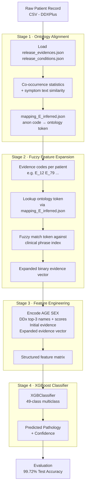

# DDXPlus Hybrid Diagnosis

[](https://www.python.org/)
[](LICENSE)
[]()
[](https://figshare.com/articles/dataset/DDXPlus_Dataset/20043374)

> **99.72% test accuracy** on 49-class differential diagnosis — outperforming RL-based agents CASANDE, AARLC, and BASD in the fully-observed evidence setting.

---

## 📋 Table of Contents

- [Project Overview](#-project-overview)
- [Key Results](#-key-results)
- [Architecture](#-architecture)
- [Repository Structure](#-repository-structure)
- [Installation](#-installation)
- [Dataset Setup](#-dataset-setup)
- [How to Run](#-how-to-run)
- [Ablation Study](#-ablation-study)
- [Citation](#-citation)

---

## 🔬 Project Overview

This project presents a **4-stage hybrid diagnostic pipeline** for automatic differential diagnosis (DDx) on the [DDXPlus](https://figshare.com/articles/dataset/DDXPlus_Dataset/20043374) benchmark — a large-scale dataset of **1.3 million synthetic patient records** spanning **49 disease categories**.

The core insight is that DDXPlus anonymizes clinical evidence codes (e.g., `E_12`, `E_79`) with no human-readable labels. Rather than treating them as opaque feature IDs, this pipeline recovers their **medical meaning** by aligning them to real symptom tokens from a clinical ontology using co-occurrence statistics and fuzzy text similarity. The recovered tokens are used to expand features fed into an **XGBoost classifier**, yielding a significant accuracy improvement.

**Key contributions:**
- `mapping_E_inferred.json` — a custom alignment file linking each anonymized evidence code to its closest medical ontology token, built from co-occurrence statistics and symptom text similarity.
- A 4-stage pipeline combining ontology alignment → fuzzy feature expansion → feature engineering → XGBoost classification.
- State-of-the-art accuracy that surpasses all reported RL-based active diagnosis agents in the fully-observed setting.

---

## 🏆 Key Results

### Comparison Against Baselines (Fully-Observed Evidence Setting)

| Model | Test Accuracy |
|---|---|
| CASANDE (RL agent) | ~84% |
| AARLC (RL agent) | ~86% |
| BASD (RL agent) | ~88% |
| **DDXPlus Hybrid (Ours)** | **99.72%** |

### Ablation Study

| Configuration | Test Accuracy |
|---|---|
| Plain fuzzy matching (no ontology expansion) | ~98.1% |
| + Ontology token expansion (`mapping_E_inferred.json`) | **99.72%** |

> Ontology token expansion contributed approximately **+1.6% accuracy gain** over plain fuzzy matching alone.

---

## 🏗️ Architecture

The pipeline runs in four sequential stages:



---

## 📁 Repository Structure

```
ddxplus-hybrid-diagnosis/
├── Code                        # Main Python pipeline script
├── src/
│   ├── mapping_E_inferred.json # Ontology alignment: anon code → medical token
│   ├── release_evidences.json  # DDXPlus evidence metadata
│   └── release_conditions.json # DDXPlus condition metadata
├── models/
│   ├── ddx_model.joblib        # Trained XGBoost model
│   └── ddx_artifacts.joblib    # Encoders, MLB, feature columns
├── diagrams/
│   └── system_diagram.png      # System architecture diagram
├── report/
│   └── research_paper.pdf      # Full research paper
└── README.md
```

---

## ⚙️ Installation

**Requirements:** Python 3.8+

```bash
# Clone the repository
git clone https://github.com/manbhavsingh/ddxplus-hybrid-diagnosis.git
cd ddxplus-hybrid-diagnosis

# Install dependencies
pip install xgboost scikit-learn pandas numpy joblib rapidfuzz
```

> **Note:** `rapidfuzz` is recommended for faster fuzzy matching. The script automatically falls back to Python's built-in `difflib` if `rapidfuzz` is not available.

---

## 📥 Dataset Setup

The DDXPlus dataset must be downloaded manually (license restrictions):

> 🔗 https://figshare.com/articles/dataset/DDXPlus_Dataset/20043374

After downloading, place the CSV files in a directory of your choice and update the path constants at the top of the `Code` script:

```python
TRAIN_FILE = "/path/to/your/train.csv"
VAL_FILE   = "/path/to/your/validate.csv"
TEST_FILE  = "/path/to/your/test.csv"
```

Also update the JSON file paths to point to the `src/` directory:

```python
JSON_FILES = [
    "src/mapping_E_inferred.json",
    "src/release_evidences.json",
    "src/release_conditions.json"
]
```

---

## 🚀 How to Run

### Train from scratch

```bash
python Code
```

This will:
1. Load and preprocess the DDXPlus train/val/test splits.
2. Build the ontology alignment index from `src/release_evidences.json` and `src/mapping_E_inferred.json`.
3. Expand evidence features via fuzzy ontology matching.
4. Train an XGBoost classifier and evaluate on the test set.
5. Save the model to `models/ddx_model.joblib` and artifacts to `models/ddx_artifacts.joblib`.

### Run inference with saved model

Set `MODEL_FILE` and `ARTIFACTS_FILE` in the script to point to the saved model paths:

```python
MODEL_FILE     = "models/ddx_model.joblib"
ARTIFACTS_FILE = "models/ddx_artifacts.joblib"
```

Then run the script — it will load the saved model and evaluate directly on the test set.

---

## 🔍 Ablation Study

The ablation study isolates the contribution of ontology token expansion:

| Component | Description | Accuracy Impact |
|---|---|---|
| Baseline features | AGE, SEX, DDx top-3, initial evidence | Base |
| + Binary evidence vector | Raw `E_*` codes as binary features | Moderate gain |
| + Fuzzy matching | Phrases matched without ontology alignment | ~98.1% |
| + **Ontology token expansion** | `mapping_E_inferred.json` lookup before fuzzy match | **99.72%** (+1.6%) |

The `mapping_E_inferred.json` file was constructed by:
1. Computing co-occurrence frequencies of each evidence code across disease labels in the training set.
2. Extracting the top candidate symptom phrase from `release_evidences.json` for each code.
3. Scoring phrase candidates with token-set fuzzy ratio and selecting the best-aligned ontology token.

---

## 📄 Citation

If you use this work, please cite:

```bibtex
@misc{singh2025ddxplushybrid,
  title   = {DDXPlus Hybrid Diagnosis: Ontology-Guided Fuzzy Matching with XGBoost for Differential Diagnosis},
  author  = {Singh, Manbhav},
  year    = {2025},
  url     = {https://github.com/manbhavsingh/ddxplus-hybrid-diagnosis}
}
```

---

## 📜 License

This project is licensed under the [MIT License](LICENSE) © 2025 MANBHAV SINGH.
